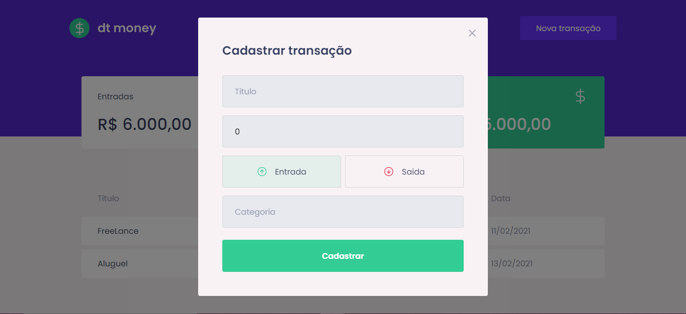

# React-JS--Ignite-dtmoney




## Installation

```bash
  $ yarn or npm install
  $ yarn start or npm start
```

## Project

A web app for finance, where you can record all your expenses that are saved in a fake API

## Functionalities

+ register new transaction
+ summary of your expenses
+ transaction display


